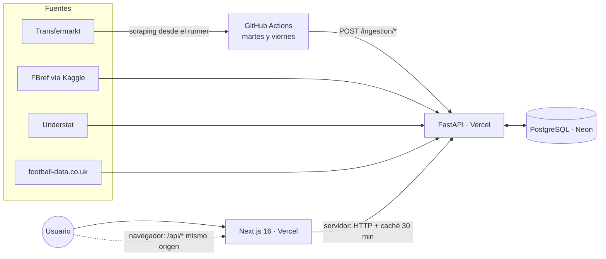

<p align="center">
  <picture>
    <source media="(prefers-color-scheme: dark)" srcset="web/public/brand/logo-dark.svg">
    
  </picture>
</p>

<p align="center">
  Scouting de jugadores y pronósticos de partidos con datos reales de 14 ligas.<br>
  <a href="https://elregista.vercel.app"><b>elregista.vercel.app</b></a>
</p>

<p align="center">
  
  
  
  
  
  
</p>

<p align="center">
  <a href="https://github.com/albertoqv/el-regista/actions/workflows/ci.yml"></a>
  <a href="https://github.com/albertoqv/el-regista/actions/workflows/security.yml"></a>
  <a href="https://github.com/albertoqv/el-regista/actions/workflows/dast.yml"></a>
  <a href="https://github.com/albertoqv/el-regista/actions/workflows/compose-vault.yml"></a>
</p>


El Regista tiene dos productos sobre la misma base de datos:

- **Scout** (jugadores): ficha con percentiles y mapa de tiros, explorador con filtros,
  *gemelos* (el mismo estilo de juego, más barato), cara a cara, rankings, tendencias y
  quién está en racha.
- **Pronósticos** (partidos): probabilidades de resultado, goles, córners, tarjetas, faltas,
  tiros y goleadores, con un historial de aciertos que se guarda antes de cada partido.

Todo funciona sobre servicios gratuitos y se actualiza solo dos veces por semana.

---

## Arquitectura



- **Una API, muchas fuentes.** Cada fuente tiene su paquete con el mismo patrón
  *client → mapper → provider*. Los casos de uso no saben de dónde viene un dato: solo ven
  los puertos (`application/ports.py`).
- **La ingesta la dispara GitHub Actions**, no un cron en el servidor. El workflow llama a
  los endpoints `/ingestion/*` (protegidos con clave) en orden. Lo que Transfermarkt bloquea
  desde la IP de un servidor se lee desde el runner, que levanta la API en local contra la
  base de datos: la ingesta no tiene límite de tiempo y la API pública solo lee.
- **La web renderiza en servidor** y pide a la API con caché incremental (ISR, 30 min). El
  navegador solo llama a la API a través de `/api/*` en el mismo dominio: no hace falta CORS.

## Stack

| Capa | Tecnología | Por qué |
|---|---|---|
| Lenguaje y entorno | **Python 3.14**, uv | Tipado estricto (mypy) y entornos reproducibles con lockfile. |
| API | **FastAPI** | Validación con Pydantic, inyección de dependencias que hace triviales los dobles de test. |
| Persistencia | **SQLAlchemy 2** + **Alembic** + **PostgreSQL** | Repositorios detrás de puertos; 16 migraciones que el refresco aplica antes de cargar datos. |
| HTTP y scraping | **httpx**, BeautifulSoup | Tests con `httpx.MockTransport` y respuestas reales recortadas. |
| Web | **Next.js 16** (App Router, Server Components), **TypeScript**, **Tailwind CSS 4** | Casi todo se renderiza en servidor: poco JavaScript y SEO completo. |
| Gráficos e imágenes | SVG hecho a mano, `next/og` | Radar, mapas de tiro, tendencias y cartas para compartir, sin librerías de gráficos. |
| Marca | Python (**shapely**, **fontTools**) | La tipografía *Regista Display*, el logo y los iconos se generan con código. |
| Calidad | pytest, mypy, ruff, Playwright, Lighthouse CI | Más de 500 tests. CI en cada push y recorridos e2e diarios contra producción. |
| Infraestructura | **Vercel** (web y API), **Neon** (PostgreSQL), **GitHub Actions** | Todo en planes gratuitos. Empezó en Railway y se migró sin cortar el servicio para que el coste sea cero. |

## Cómo funciona

### Clean Architecture

```
src/player_scouting/
├── domain/          # Entidades y cálculo puro: estadísticas, percentiles, modelos, roles, tendencias
├── application/     # Casos de uso y puertos (interfaces), cruce de jugadores entre fuentes
├── infrastructure/  # Un paquete por fuente (fbref_kaggle, understat, transfermarkt...) y persistence
└── presentation/    # FastAPI: routers, esquemas, seguridad, caché y límites
```

El dominio no importa nada de fuera. Los casos de uso se prueban con repositorios en
memoria que imitan al de SQL, y los de SQL se prueban contra un Postgres real. El
desarrollo sigue TDD estricto: cada cambio entra como `test:` y luego `feat:`.

### Datos: de cuatro fuentes a un jugador

| Fuente | Qué aporta |
|---|---|
| FBref (dataset de Kaggle) | Estadísticas por temporada de las 5 grandes ligas. |
| Understat | xG, xA, tiros con coordenadas, alineaciones partido a partido y calendario. |
| Transfermarkt (web y dataset de Kaggle) | Fotos, fechas de nacimiento, posición detallada, valores de mercado y 9 ligas más. |
| football-data.co.uk | Córners, tarjetas, faltas, árbitro y cuotas. |

Unir fuentes sin un identificador común es la parte difícil:

- **Cruce de jugadores** (`application/player_matching.py`): nombre normalizado, luego
  subconjunto de tokens y, en último caso, mismo equipo con minutos y goles casi iguales.
  Cruza en torno al 95% de los jugadores de Understat.
- **Nombres de equipo**: FBref abrevia ("Manchester Utd"). El sistema aprende la equivalencia
  con los nombres de Understat a partir de los jugadores ya cruzados (votación por mayoría) y
  la aplica a todas las temporadas.
- **Duplicados**: un jugador escrito de dos formas se fusiona por identificador de Understat
  o de Transfermarkt.
- **Identificadores estables**: FBref no trae ID, así que se usa un hash de nombre y año de
  nacimiento. Los jugadores creados desde Transfermarkt van en su propio rango.
- **Salud de los datos**: `GET /health/data` devuelve 503 si hay partidos jugados hace días
  sin resultado. Además lista los jugadores cuyos goles no cuadran entre FBref y Understat.
  El workflow lo comprueba al terminar cada refresco.

### Modelos

**Resultado de los partidos** (`domain/prediction.py`)
- Poisson con corrección de Dixon-Coles.
- La fuerza de ataque y defensa de cada equipo sale de:
  - una mezcla de xG (85%) y goles reales;
  - decaimiento exponencial (vida media de 180 días, elegida en el laboratorio de modelos);
  - ajuste por rival;
  - encogimiento hacia la media.
- Validación walk-forward (cada partido se predice solo con datos anteriores): Brier 0,594
  en 25/26 frente a 0,649 de la referencia.
- Las cuotas de cierre llegan a 0,582. Cuando hay cuotas, el 1X2 que se muestra es el del
  mercado, y la web lo dice.
- **Probado y descartado** en `scripts/model_lab.py`: el descanso entre partidos, el empate por
  liga, la calibración, un punto de partida más bajo para los ascendidos y la mezcla con un Elo.
  Ninguno mejora la temporada de validación con un 95% de confianza.

**Estadísticas del partido** (`domain/counts.py`)
- Binomial negativa por equipo para córners, faltas, tiros y tarjetas, con encogimiento de
  10 partidos.

**Jugadores en un partido** (`domain/player_props.py`)
- Probabilidad de marcar, asistir o ver tarjeta *si juega*, multiplicada por la probabilidad
  de jugar.
- Brier 0,067 frente a 0,074 en 10.840 pronósticos.

**Historial**
- Las predicciones de los próximos 7 días se guardan antes del saque inicial y se puntúan
  después. No se pueden retocar.

**Gemelos** (`application/use_cases/find_twins.py`)
1. Cada jugador se describe con percentiles por 90 minutos dentro de su liga, temporada y
   posición, más su perfil de tiro (cabeza, de lejos, tramo final, balón parado, definición).
2. El parecido es 100 menos la diferencia media de percentiles.
3. El rol detallado también pesa:
   - mismo rol: sin penalización;
   - rol vecino (extremo derecho e izquierdo, interior y mediapunta…): −4;
   - rol a dos pasos: −10;
   - roles lejanos: −20.
   Los roles híbridos (extremo y medio de banda) cruzan la frontera entre posiciones.
4. En las ligas con solo goles y asistencias, la comparación es básica, entre jugadores del
   mismo rol, y la web lo avisa.

**Tendencias** (`domain/trends.py`)
- xG+xA de cada partido y su media móvil de 5 partidos por 90 minutos, a partir de las
  alineaciones de Understat.
- Marca "al alza" o "a la baja" si el nivel reciente se mueve al menos un 20% (y 0,1)
  respecto a lo anterior.
- También compara los goles con el xG acumulado.

### API

- **Caché en memoria** de las respuestas GET (32 MB, LRU, 10 min, cabecera `X-Cache`). Se
  vacía con cualquier ingesta, así que nunca sirve datos viejos.
- **Copia de seguridad**: `GET /ingestion/backup` emite en streaming un volcado `COPY` en gzip
  (el mismo formato que `pg_dump --data-only`). Un workflow semanal lo guarda 90 días y se
  restaura con `restore_data` o con `psql`.
- **Métricas propias**: visitas sin cookies ni IP (hash diario con sal), latencias p50/p95,
  errores del navegador y calidad de los datos, en un panel privado.

### Seguridad

- La ingesta y el panel exigen clave, comparada en tiempo constante.
- En producción, si falta la clave, la API **se cierra**: devuelve 503, no abre la ingesta.
- Las direcciones que fallan la clave 10 veces quedan bloqueadas 15 minutos.
- Límite de peticiones por IP y `/docs` oculto en producción.
- El panel de administración usa sesiones firmadas que caducan: el navegador nunca guarda la
  clave.
- La web manda CSP, `X-Frame-Options`, `Referrer-Policy`, `Permissions-Policy` y HSTS.
- Su proxy `/api/*` no deja pasar ni la ingesta ni el panel.
- Cabeceras `nosniff` y `Cross-Origin-Resource-Policy` en todas las respuestas de la API.
- Análisis de código, dependencias, secretos, contenedores y DAST en el CI (ver abajo).
- Los secretos no están nunca en el código (ver abajo).

### Secretos: Vault en local, variables en producción

La clave de la API y las credenciales de la base de datos no aparecen en el código ni en el
repositorio. Así se pueden cambiar sin tocar el código ni redesplegar con otro build, el
historial de git no las expone nunca y cada entorno tiene las suyas.

- **En local** (`docker compose up`) hay un **HashiCorp Vault** en modo desarrollo. Un paso
  de arranque (`vault-init`) guarda los secretos en `secret/el-regista` (KV v2) y la API los
  lee al arrancar con `VAULT_ADDR` y `VAULT_TOKEN`.
- **En producción** no hay Vault: Vercel y GitHub guardan los secretos como variables de
  entorno cifradas, y la API las lee igual que siempre.
- Las dos vías entran por el mismo sitio: una fuente de configuración de
  `pydantic-settings` (`infrastructure/secrets/vault.py`) que va por debajo de las variables
  de entorno. Una variable siempre manda y Vault rellena lo que falta. Sin `VAULT_ADDR` no se
  consulta nada.
- Si Vault está configurado pero no responde o niega el acceso, la API **no arranca**. Es
  mejor que arrancar sin clave de ingesta.
- El modo desarrollo guarda todo en memoria, sin sellar y con un token fijo: sirve para
  probar en local y no se usa nunca en producción. `compose-vault.yml` levanta el stack en CI
  y comprueba que la API llega a la base y solo abre la ingesta con la clave de Vault.

### Seguridad (DevSecOps)

Cada capa tiene su herramienta en el CI. Todas son gratuitas y no necesitan cuenta. Los
resultados se suben en SARIF a la pestaña **Security** de GitHub. Las herramientas
empezaron en modo informe; tras revisar los hallazgos, bloquean las que no dan falsos
positivos.

| Capa | Herramienta | Cuándo | Bloquea |
|---|---|---|---|
| SAST | **Semgrep** (`p/python`, `p/typescript`, `p/secrets`) | cada push y PR | no: informe |
| SAST | **Bandit** (backend) | cada push y PR | severidad alta |
| SCA | **pip-audit** y **npm audit** | cada push y PR | dependencias de producción |
| SCA | **Dependabot** (uv, npm, Actions, Docker, Compose) | semanal | — |
| Secretos | **gitleaks** sobre todo el historial | cada push y PR | sí |
| Contenedores | **Trivy**: Dockerfiles, Compose e imágenes | cada push y PR | CVE CRITICAL y configuración HIGH |
| DAST | **OWASP ZAP** baseline | lunes y a mano | no: informe |

- **ZAP** escanea el mismo stack local que `compose-vault.yml` (Postgres, Vault y la imagen
  de la API), con la lista de endpoints que da su OpenAPI. Producción solo se escanea a
  mano (`workflow_dispatch`, `target: production`). El informe queda como artefacto.
- **gitleaks y Trivy** se instalan desde sus binarios con versión fija y checksum
  verificado, no desde acciones de terceros cuya etiqueta podría moverse.
- Los falsos positivos se marcan **en la línea**, con el motivo (`# nosec`, `# nosemgrep`,
  `# trivy:ignore`, `.gitleaksignore`, `.zap/rules.tsv`). No se apaga ninguna regla para
  todo el proyecto, salvo B101 de Bandit (motivo en `pyproject.toml`).

**Hallazgos y cómo se resolvieron**

| Herramienta | Hallazgo | Resolución |
|---|---|---|
| Trivy | Los dos contenedores arrancaban como `root` (DS-0002, HIGH) | Usuario sin privilegios: `app` (uid 10001) en la API y `node` en la web |
| Trivy | `python:3.14-slim`: 5 CVE HIGH (`libpcre2`, y `urllib3`, `msgpack` y `setuptools` de `pip`) | Imagen en dos etapas: `uv` solo al construir; la final con los parches de Debian y sin `pip` → 0 |
| Trivy | `node:20-slim`: Node 20 sin soporte y 39 CVE (6 CRITICAL) | `node:24-slim` (LTS) con los parches de Debian |
| Trivy | 7 CVE HIGH en el `npm` que trae la imagen (`tar`, `brace-expansion`, `ip-address`, `undici`) | `npm` y `corepack` fuera de la imagen final: solo se ejecuta `node server.js` → 0 |
| Trivy | Sin `HEALTHCHECK` (DS-0026) | Añadido en las dos imágenes |
| Trivy | "Secreto en ENV" por `REQUIRE_INGESTION_KEY` (DS-0031, CRITICAL) | Falso positivo: es un interruptor `true`/`false`; se ignora solo esa línea |
| ZAP | Faltaba `X-Content-Type-Options` (10021) | `nosniff` en todas las respuestas de la API |
| ZAP | Faltaba `Cross-Origin-Resource-Policy` (90004) | `same-origin`, salvo `/metrics/*`, que la web llama desde otro dominio (`cross-origin`) |
| ZAP | Contenido cacheable (10049, informativo) | Intencionado: datos públicos cacheados para ahorrar transferencia |
| gitleaks | Cabecera con clave en `compose-vault.yml` | No era un secreto, sino el valor de prueba del stack local. Ahora cada ejecución genera una clave aleatoria; el commit antiguo, en `.gitleaksignore`. Historial limpio: 452 commits |
| Semgrep | "SQL injection" en `admin.py` | Falso positivo: es el `.execute()` de un caso de uso; las consultas van por el ORM |
| Semgrep | SHA-1 en `model_lab.py` | Falso positivo: nombre de un fichero de caché, no seguridad |
| Bandit | 7 × `assert` (B101) y "contraseña" en una ruta de Vault (B105) | Falsos positivos: los `assert` solo estrechan tipos para mypy; la ruta no es secreta |
| npm audit | `braces` ≤ 3.0.3 (GHSA-vfj7-8cjw-p6xm) en una dependencia de ESLint | Sin versión corregida publicada; solo en desarrollo y con patrones propios. Informe, sin bloquear |

### Web

- **Server Components**, con JavaScript de cliente solo donde hay interacción (buscador,
  filtros).
- Animaciones en CSS, que respetan `prefers-reduced-motion`.
- **SEO**:
  - rankings por liga y métrica;
  - datos estructurados schema.org (Person, SportsTeam, SportsEvent, ItemList);
  - sitemap de unas 900 URLs;
  - feed RSS de próximos partidos.
- **Lighthouse en producción**: accesibilidad 100, buenas prácticas 100 y SEO 100. Letra
  mínima de 13 px y sin desbordes de 390 a 1280 px.

### Operaciones

| Workflow | Cuándo | Qué hace |
|---|---|---|
| `ci.yml` | cada push | pytest contra Postgres, mypy, ruff y auditoría de dependencias |
| `web-e2e.yml` | push que cambia `web/` | Build de producción y recorridos Playwright |
| `compose-vault.yml` | cambios en compose, Dockerfile o secretos | Stack local con Vault: la API arranca con sus secretos |
| `security.yml` | cada push y PR | Semgrep, Bandit, gitleaks y Trivy (SARIF a Security) |
| `dast.yml` | lunes y a mano | OWASP ZAP baseline contra el stack local |
| `weekly-fbref-refresh.yml` | martes y viernes | Ingesta completa y comprobación de los datos |
| `web-quality.yml` | diario | Recorridos Playwright y Lighthouse CI contra producción |
| `monitor.yml` | cada 3 h | La API y la web responden, con datos reales |
| `backup.yml` | domingos | Copia de la base de datos como artefacto |

---

## Desarrollo

```bash
uv sync && uv run pytest                     # tests (los de Postgres necesitan DATABASE_URL)
uv run mypy && uv run ruff check .
uv run uvicorn player_scouting.presentation.api.main:app --reload
cd web && npm install && npm run dev         # web en http://localhost:3000
cd web && npm run e2e                        # Playwright (BASE_URL=... para otro entorno)
```

`docker compose up` levanta Postgres, Vault, la API (en `:8000`, con la clave de ingesta
`local-ingestion-key`) y la web. La base de datos sola se levanta con
`docker compose up -d db` o con `scripts/local_postgres_start.ps1`. Se migra con `uv run alembic upgrade head` y se llena
llamando a los endpoints `/ingestion/*` en el orden del workflow semanal.

## Licencia

Todos los derechos reservados. El repositorio es público como muestra de trabajo personal; no
se concede permiso para copiar, modificar o reutilizar el código sin autorización expresa del
autor. Los datos pertenecen a sus fuentes y las fotos a sus autores, según sus licencias
([nota de fuentes](docs/fuentes-y-licencias.md)).
